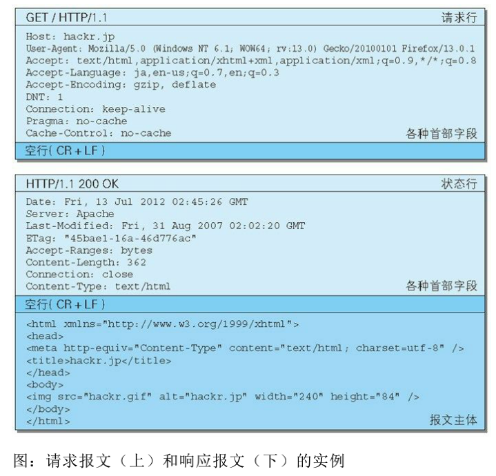

### HTTP 报文
> 用于 HTTP 协议交互的信息被称为 HTTP 报文。请求端（客户端）的 HTTP 报文叫做请求报文，响应端（服务器端）的叫做响应报文

#### 请求报文及响应报文的结构

-  请求行 包含用于请求的方法，请求 URI 和 HTTP 版本。
-  状态行 包含表明响应结果的状态码，原因短语和 HTTP 版本。 
-  首部字段 包含表示请求和响应的各种条件和属性的各类首部。一般有 4 种首部，分别是：通用首部、请求首部、响应首部和实体首 部。其他

#### HTTP 首部字段根据实际用途被分为以下 4 种类型。 
- 通用首部字段（General Header Fields）
> 请求报文和响应报文两方都会使用的首部。
- 请求首部字段（Request Header Fields）
> 从客户端向服务器端发送请求报文时使用的首部。补充了请求的附加 内容、客户端信息、响应内容相关优先级等信息。
- 响应首部字段（Response Header Fields）
> 从服务器端向客户端返回响应报文时使用的首部。补充了响应的附加 内容，也会要求客户端附加额外的内容信息。
- 实体首部字段（Entity Header Fields）
> 针对请求报文和响应报文的实体部分使用的首部。补充了资源内容更 新时间等与实体有关的信息。

#### HTTP/1.1 首部字段一览
HTTP/1.1 规范定义了如下 47 种首部字段。  
**通用首部字段**

**请求首部字段**

**响应首部字段**

**实体首部字段**

#### 非 HTTP/1.1 首部字段
在 HTTP 协议通信交互中使用到的首部字段，不限于RFC2616中定 义的 47 种首部字段。还有 Cookie、Set-Cookie和Content-Disposition 等在其他 RFC 中定义的首部字段，它们的使用频率也很高。这些非正式的首部字段统一归纳在 RFC4229 HTTP Header Field Registrations 中。

#### End-to-end 首部和 Hop-by-hop 首部
HTTP 首部字段将定义成缓存代理和非缓存代理的行为，分成 2 种类 型。  
**端到端首部（End-to-end Header）**  
 分在此类别中的首部会转发给请求 / 响应对应的最终接收目标，且必 须保存在由缓存生成的响应中，另外规定它必须被转发。 
 **逐跳首部（Hop-by-hop Header）**  
  分在此类别中的首部只对单次转发有效，会因通过缓存或代理而不再 转发。HTTP/1.1 和之后版本中，如果要使用 hop-by-hop 首部，需提 供 Connection 首部字段。
  
  下面列举了 HTTP/1.1 中的逐跳首部字段。除这 8 个首部字段之外， 其他所有字段都属于端到端首部。
  - Connection 
  - Keep-Alive 
  - Proxy-Authenticate 
  - Proxy-Authorization 
  - Trailer 
  - TETransfer-Encoding 
  - Upgrade