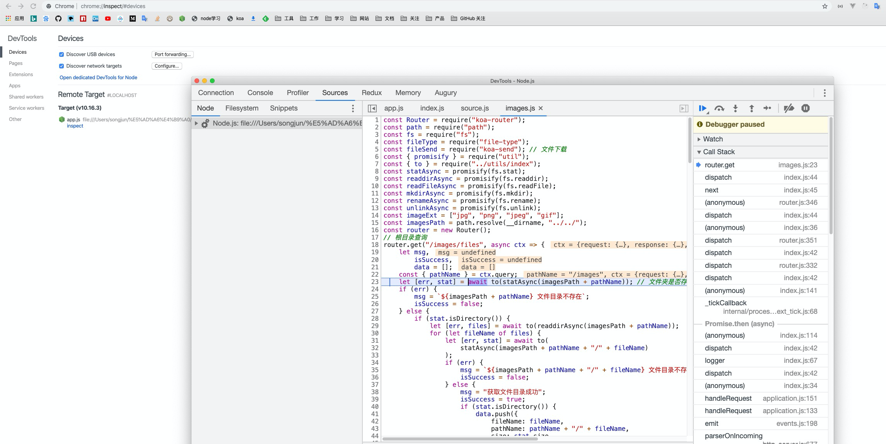
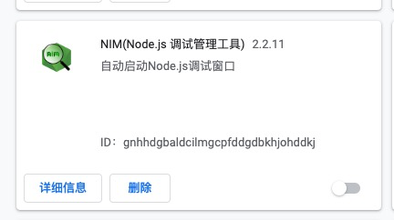
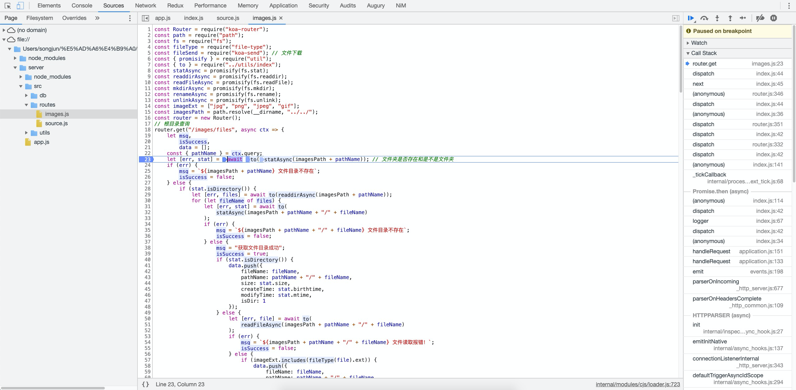
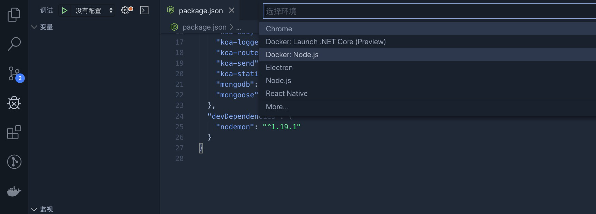
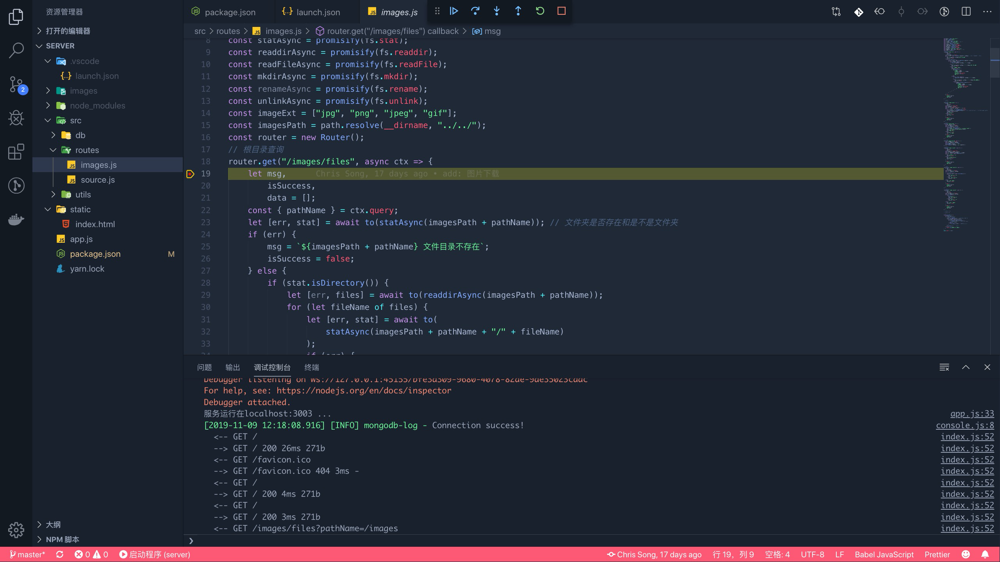

作为一个nodejs 的初学者，先学会nodejs的调试是很有用的，这里总结下，nodejs 中常用的两种调试方式。

#### 第一种： node inspeect + 浏览器
```javascript
> node inspect app.js
< Debugger listening on ws://127.0.0.1:9229/0952e250-ef6d-42e8-8ed5-86c5c17e6311
< For help, see: https://nodejs.org/en/docs/inspector
< Debugger attached.
Break on start in file:///Users/songjun/%E5%AD%A6%E4%B9%A0/github/dataView/server/app.js:1
```

这种方式是官方推荐的调试方式，直接在终端输入带有inspect 参数的命令行，当启动--inspect开关时，Node.js进程将侦听调试客户端。默认情况下，它将侦听主机和端口127.0.0.1:9229。还为每个进程分配了唯一的UUID。

这时我们就可以在浏览器打开这个服务地址来进行调试：在基于Chromium的浏览器中打开chrome：// inspect，或在Edge中打开edge：// inspect。单击“配置”按钮，并确保列出了目标主机和端口。然后点击Open dedicated DevTools for Node 就会出现一个Chrome 检查弹出框


假如不想每次都进行配置调试，可以在Chrome直接安装一个nodejs 调试器插件

当每次启动的时候会自动打开一个调试页面



#### 第二种：vscode + launch.json
在vscode 中打开调试工具，然后配置nodejs 调试会在根目录出现一个.vscode 文件夹里面有个launch.json 配置文件


通过配置启动文件program可以进行调试
> launch.json
```JSON
{
    // 使用 IntelliSense 了解相关属性。 
    // 悬停以查看现有属性的描述。
    // 欲了解更多信息，请访问: https://go.microsoft.com/fwlink/?linkid=830387
    "version": "0.2.0",
    "configurations": [
        {
            "type": "node",
            "request": "launch",
            "name": "启动程序",
            "program": "${workspaceFolder}/app.js"
        }
    ]
}
```
启动脚本文件，在vscode 直接打断点调试

